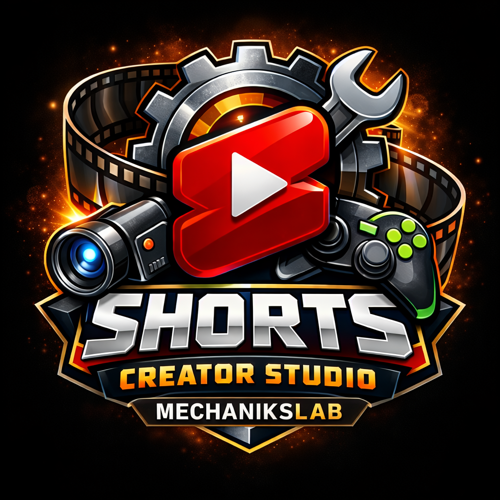

  

# Лаборатория Механика - ИИ Студия Создания Контента

> Гибкая AI-студия для автоматического создания Shorts/Reels/TikTok из длинных видео: от поиска моментов до рендера, перевода, переозвучки, субтитров и цензуры мата.

---

**Текущая версия:** `v1.7.0`

---

## 🚀 О проекте

**Лаборатория Механика - ИИ Студия Создания Контента** — desktop-приложение для авторов и монтажёров, которым нужен быстрый и управляемый конвейер short-form контента.

Программа объединяет в одном интерфейсе:
- автосоздание шортсов,
- удаление мата из видео,
- перевод и переозвучку,
- генерацию и стилизацию субтитров.

Все ключевые этапы настраиваются: модели, качество, фильтры, шаблоны, режимы обработки и пресеты.

---

## ✨ Основные фичи

## 1) Автосоздание шортсов (Auto Shorts)
- поиск «сильных» фрагментов по распознанной речи;
- фильтрация повторов и слабых моментов;
- ручной выбор кандидатов перед экспортом;
- настройка рендера (FPS, качество, backend, разрешение);
- шаблоны раскладки и предпросмотр результата.

**Как пользоваться:**
1. Откройте вкладку **«Создание шортсов»** и выберите исходное видео.
2. Запустите анализ речи и поиск кандидатов.
3. Просмотрите найденные моменты, отключите лишние и оставьте лучшие.
4. При необходимости настройте шаблон раскладки (кадр, зоны, визуал).
5. Нажмите рендер и получите готовые short-клипы.

## 2) Удаление мата из видео (Антимат)
- ASR-анализ речи с таймингами;
- определение мата по словарям и/или LLM;
- ручной и автоматический сценарии обработки;
- режимы цензуры: `beep` и `mute`;
- гибкая настройка зон цензуры (до/после слова, склейка, лимиты длительности);
- пресеты антимата для быстрых повторных запусков.

**Как пользоваться:**
1. Перейдите в **«Система Антимат»** и загрузите видео/аудио.
2. Выберите режим поиска (гибридный с LLM или только списки слов).
3. Нажмите **«Анализ речи и поиск мата»**.
4. Проверьте найденные зоны (при необходимости включите/исключите вручную).
5. Выберите способ цензуры: `beep`, `mute` или смешанный.
6. Примените цензуру и сохраните итоговый файл.

## 3) Перевод и переозвучка видео (Video Translate)
- pipeline: распознавание → перевод → синтез новой речи;
- voice clone (XTTS) и поддержка RVC-сценариев;
- diarization (разделение спикеров) и source separation (Demucs/UVR);
- fallback-режимы для стабильной обработки на разных конфигурациях.

**Как пользоваться:**
1. Откройте раздел **«Переозвучка/Перевод видео»** и выберите исходник.
2. В настройках задайте целевой язык и режим озвучки (auto/xtts/rvc).
3. При необходимости включите разделение спикеров и source separation.
4. Запустите обработку: программа выполнит ASR, перевод и синтез речи.
5. Проверьте результат и экспортируйте переведённое/переозвученное видео.

## 4) Генерация субтитров с эффектами
- транскрибация и подготовка текста;
- перевод/оптимизация субтитров;
- стили, пресеты и визуальные эффекты;
- настройка читаемости, safe-area, движения, karaoke-режимов;
- рендер в едином стиле для серии роликов.

**Как пользоваться:**
1. Загрузите видео в **«Создание субтитров»** или начните с **«Распознавание речи»**.
2. Выполните транскрибацию и при необходимости перевод/оптимизацию текста.
3. Откройте **«Стиль субтитров»** и выберите пресет или настройте стиль вручную.
4. Проверьте предпросмотр (эффекты, цвета, позиционирование).
5. Запустите синтез видео с субтитрами.

## 5) Пакетная обработка
- массовая обработка файлов в одном режиме;
- режимы: транскрибация, субтитры, полный цикл;
- удобно для каналов с большим потоком контента.

**Как пользоваться:**
1. Откройте **«Пакетная обработка»**.
2. Выберите тип задачи: транскрибация / субтитры / полный цикл.
3. Добавьте файлы или папку с контентом.
4. Укажите выходную директорию и параметры обработки.
5. Запустите пакет и контролируйте прогресс по задачам.

---

## ⚙️ Гибкая настройка

В проекте можно тонко управлять:
- ASR/LLM/переводчиками;
- параметрами шортсов и антидублей;
- параметрами антимата и профилями beep;
- стилем и эффектами субтитров;
- качеством и режимами переозвучки;
- пользовательскими шаблонами и пресетами.

**Как пользоваться:**
1. Перейдите в раздел **«Настройки»**.
2. Настройте нужные сервисы (ASR, переводчики, LLM, voice-провайдеры).
3. Сохраните параметры и вернитесь в рабочий модуль.
4. Для повторяемого результата используйте пресеты и шаблоны.

---

## 📦 Запуск

Рекомендуемый способ для пользователей:

1. Скачать актуальный архив из **Releases**.
2. Распаковать в отдельную папку.
3. Запустить `ContentCreatorAIStudio.exe`.

> В релизной сборке уже подготовлены основные runtime-компоненты и ресурсы.

---

## 🛠 Технологии

- Python + PyQt5 + QFluentWidgets
- FFmpeg
- Whisper/faster-whisper (ASR)
- XTTS / RVC / pyannote / Demucs / UVR (для модуля перевода и переозвучки)

---

## 🙏 Благодарности

- Базовая идея: [WEIFENG2333/VideoCaptioner](https://github.com/WEIFENG2333/VideoCaptioner)
- Развитие проекта: [MechaniksLab/ContentCreatorAIStudio](https://github.com/MechaniksLab/ContentCreatorAIStudio)

---

## 📮 Обратная связь

Если нашли баг или хотите предложить улучшение — создайте Issue в репозитории.
